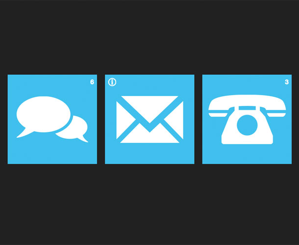

#Building a notification monitor on hydna#

> That awkward moment when your gone for 2 weeks and expect to have like a ZILLION notifications but you end up only having like, 3.

##Notifications##

###What is it?###
Notifications is a simple monitor that shows you current status of things. It is perfect to have on a TV or a larger monitor. The application is built using HTML and CSS and is using hydna for communication.

[Try it out](http://hydna.github.com/notifications) or [Check out the source](http://www.github.com/hydna/notifications)

##Setup##

A hydna account is required in order to run the application. Head over to the [Create account](https://www.hydna.com/account/signup/) section if you not already have an account. It is free to get started.

You can set your domain simple by defining the global variable `HYDNA_URL` somewhere in the source:

    <head>
      ...
      
      ...
    </head>

###Random channels###

The live demo is on a public server so we need to generate random channels to listen on (app.js):

   channelOffset = Math.floor(Math.random() * 0xFFFFF5) + 1;
   
You can set the channel offset to a constant value if you decide to run the application on your own domain.

###Receiving notifications###

Each notification pane has it's own channel. The application is listening on them for commands. The commands are:

1. `incr` - Increases panes counter by one.
2. `decr` - Decreases panes counter by one.
3. `set [arg]` - Set panes counter to a specific value.
4. `reset` - Resets panes counter.

Each time one of these commands is sent, the application answers to them by changing the state of the pane. The easiest way to test this is to launch your terminal and send a message via [CURL](http://en.wikipedia.org/wiki/CURL).

Here is an example when we increases the counter of first pane:

    $ curl -d "incr" mydomain.hydna.net/1

The message loop is fairly simple. We define an `onmessage` handler that waits for data to be received. Once received, we check the commands against our built-in command reference. We simple ignore the message on no match:

    function onmessage (event) {
        var realid = this.id - channelOffset;
        var command;
        var arg;

        hideinstructions();

        command = typeof event.data == "string" ? event.data.toLowerCase() : "";
        arg = command.split(" ")[1];
        command = command.split(" ")[0];

        switch (command) {

          case "incr":
            incr(panes[realid]);
            break;

          case "decr":
            decr(panes[realid]);
            break;

          case "reset":
            reset(panes[realid]);
            break;

          case "set":
            set(panes[realid], arg);
            break;
        }
      }
    }

After the `onmessage` handle is defined, we simple assign it to each channel.

    function setuppane (pane, id) {
      var urls = pane.getElementsByClassName("url");
      var realid = channelOffset + id;
      var chanurl = hydnaurl + realid;
      var channel;

      pane.addEventListener("click", onpaneclick, false);

      for (var i = 0; i < urls.length; i++) {
        urls[i].innerHTML = chanurl;
      }

      channel = new HydnaChannel(chanurl, "r");
      channel.onopen = onopen;
      channel.onmessage = onmessage;
      channel.onerror = onerror;
    }

    for (var i = 0; i < panes.length; i++) {
      setuppane(panes[i], i);
    }

###Further improvements###

This application is fairly simple. We could for example improve it by defining more panes. There is no security either. What you would do in a real-world application is to implement a token system. This is done via [behaviors](https://www.hydna.com/documentation/behaviors/introduction/).

Put this piece of code in your `setup.be`-file:

    // setup.be

    SECRET_TOKEN = "mypassword"

    open
      channel = range(100, 102)  // Matches all channels between 100-102
        token = SECRET_TOKEN  
          allow()                // Allow the open request if token matches
        end
        deny()                   // Else, deny it!
      end
    end
    
We also have to change how we open the channel in your Javascript application:

    // index.html
    
    <head>
      ...
      
      ...
    </head>

And, of course, how we push the commands from CURL:

    $ curl -d "incr" mydomain.hydna.net/1?mypassword

