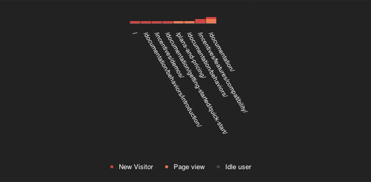

#Building a real-time visitor monitor on hydna#

> There is no reason to fear the wind if your stack of hay is well tied

##Stacks##

###What is it?###
Stacks tracks new visitor and pages-views on your website. The application is built using HTML and CSS and is using hydna for communication.

[Try it out](http://hydna.github.com/stacks) or [Check out the source](http://www.github.com/hydna/stacks)

##Setup##

A hydna account is required in order to run the application. Head over to the [Create account](https://www.hydna.com/account/signup/) section if you not already have an account. It is free to get started.

You can set your domain simple by defining the global variable `HYDNA_URL` somewhere in the source:

    <head>
      ...
      
      ...
    </head>

###Tracker script###

We need a script that is loaded each time a user navigates on the website in order to track them. Each visitor get's an "unique" id. This is required for Stacks to keep track of each visitor:

    if ((m = /hydna_stacks_uuid\=([A-Za-z0-9\-]+)/.exec(document.cookie))) {
      useruuid = m[1];
    } else {
      useruuid = (function () {
          var S4 = function() {
             return (((1+Math.random())*0x10000)|0).toString(16).substring(1);
          };
          return (S4()+S4()+"-"+S4()+"-"+S4()+"-"+S4()+"-"+S4()+S4()+S4());
      })();
      document.cookie = "hydna_stacks_uuid=" + useruuid;
    }

The rest is pretty straight forward. Each message contains the user id and the current location pathname. We also send a heartbeat each 15 sec:

    chan = new HydnaChannel(HYDNA_URL, 'w');

    chan.onopen = function(e) {
      function send () {
        try {
          chan.send(useruuid + " " + document.location.pathname, 2);
        } catch (err) {
          // just ignore...
        }
      }
      setInterval(send, HEARTBEAT_INTERVAL);
      send();
    };

Please notices that we are sending the message with priority set:

    chan.send(useruuid + " " + document.location.pathname, 2);
    
We do this so that Tracks don't get flooded under hi-load.

Don't forget to change the hydna URL in your tracker script when implementing on your own website:

    var HYDNA_URL = "mydomain.hydna.net";

###Further improvements###

One thing that comes to mind instantly is the ability to track different sites from the same monitor. For example, each site could have it's own color scheme. We could include the `hostname` in each heartbeat:

    location = document.location;
    msg = [useruuid, location.host, location.pathname].join(" ");
    chan.send(msg , 2);

And change our message loop to take one more argument:

      if (!(m = /([a-z0-9\-]+)\s(.+)\s(.+)/.exec(e.data))) {
        return;
      }

      uuid = m[1];
      host = m[2];
      ref = m[3];
