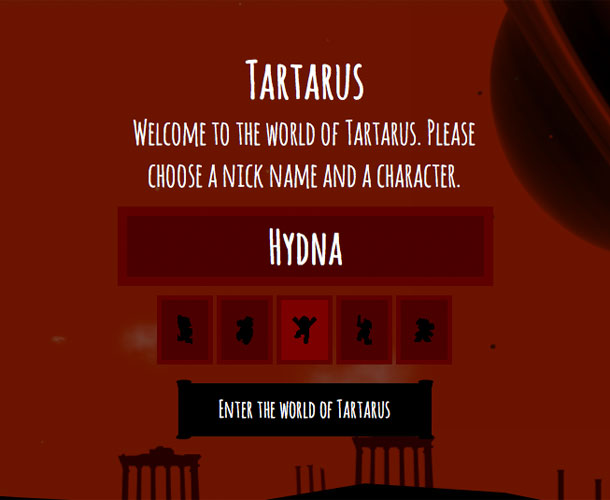

#Building a virtual world on hydna#

> In Greek mythology, Tartarus is both a deity and a place in the underworld. In ancient Orphic sources and in the mystery schools, Tartarus is also the unbounded first-existing entity from which the Light and the cosmos are born.

##Tartarus##

###What is it?###
Tartarus is a multi-user environment, where users can interact with each other via chat messages. It uses HTML5 canvas to draw the world and hydna for communication between the clients.

[Try it out](http://hydna.github.com/tartarus) or [Check out the source](http://www.github.com/hydna/tartarus)

##Setup##

A hydna account is required in order to run the application. Head over to the [Create account](https://www.hydna.com/account/signup/) section if you not already have an account. It is free to get started.

###Room creation###

Usually in an application like this you want to control the maximum number of users on screen. The clients throughput limits the performance if we have too many users on screen at once. You can change the number of rooms and users per room in `setup.be`:

    
    NUMBER_OF_ROOMS = 20 // Number of rooms

    SCRIPT_ENV = {
      ...
      MAX_USERS:        100 // Maximum number of users per room
      ...
    }

When the user opens a channel to hydna, we redirect them to an open room with free slots. In `setup.be`:

    channel = HANDSHAKE_CHANNEL
      run("./onhandshake.js", SCRIPT_ENV)
      when = $CODE
        redirect($CODE, $MESSAGE)
      end
      deny($MESSAGE)
    end

Now, in `onhandshake.js`, we need to find a free room. We do this by looping through all room channels:
  
    for (var id = ROOM_CHANNEL; id < length; id++) {
      room = domain.getChannel(id);

We try to increase our `key` "count" on the room channel. The `room.incr()` returns `true` on success and `false` on failure:

    room.incr("count", MAX_USERS)

If we manage to increase the counter, we add the user to the [channels state](https://www.hydna.com/documentation/behaviors/scripts/#documentation-behaviors-scripts-channel) and notify all other users that a new user is connected:

    room.push("users", hexid + ":" + type + ":" + name);

    message = {
      "method": "user-connect",
      "params": {
        "id": hexid,
        "name": name,
        "type": type
      }
    };

    room.emit(JSON.stringify(message));

We now need to tell behaviors which channel we where redirected to. We do this by using the scripts exit code. We also need to tell the users it's connection id. This is the exit message of the script:

    exit(room.id, hexid);

One important thing that needs to be done is to block clients from opening a room channel directly. They **must** connect through our "gateway channel":

    for (var INDEX = 0; INDEX < NUMBER_OF_ROOMS; INDEX++) {
    channel = ROOM_CHANNEL + INDEX
      deny("ERR_OPEN_VIA_HANDSHAKE")
    end
    }

Notice how we use plain old javascript to generate behavior code for us.

###Rendering loop###

Each game-tick sends out the state of the users to all other users. The interval is here set to each forth frame tick. You can find the code in `js/network.js`:

    if (user && connectionid && (framecount++) % 4 == 0) {

      message = {
        type: "state",
        id: connectionid,
        x: user.x,
        y: user.y,
        velx: user.velx,
        vely: user.vely,
        state: user.state
      };

      roomChannel.send(JSON.stringify(message));
    }

###Pushing behaviors###

Thats is, we are now ready to upload the bahaviors using the "hydna command line tool". In the root directory, where `<api-key>` and `<domain name>` is your settings:

    $ cd behaviors
    $ hydna push --api-key=<api key> --domain-name=<domain name>

###Further improvements###

This is just the start. There is much room for improvement. One big part is [interpolation](http://en.wikipedia.org/wiki/Linear_interpolation). The updating frequency may feel sluggish if you are located in Europe, and the server is located in US or visa verse, or if you are sitting on an internet line with high latency.

Also, we could support more browsers and mobile phones.